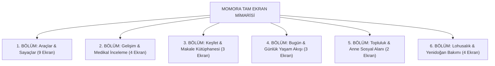

# MOMORA · A'dan Z'ye Tam Ekran & Full-Paket Prompt Kataloğu

Bu katalog, **Dünya ve Türkiye pazar liderlerinin (Philips Pregnancy+ & Happy Mom)** 34 ekranlık envanterinden çıkarılan, Momora'nın zirveye yerleşmesi için gereken **25 eksik ekranın tam UI/UX mimarisini ve birebir yapay zeka (Midjourney / DALL-E / UI Generator) promptlarını** içerir.

> **Momora Tasarım İmzası (Claymorphic Luxury):**  
> Tüm ekranlar ve bileşenler soğuk hastane beyazı yerine **Momora'nın sıcak, yatıştırıcı, pastel porselen-kil dokusuyla** tasarlanır:  
> - **Sıcak Krem:** `#FAF7F3`  
> - **Mauve / Gül Kurusu:** `#9D7D9D`  
> - **Adaçayı Yeşili:** `#79A58D`  
> - **Lavanta / Lila:** `#EEE7F4`  
> - **Şeftali / Pudra:** `#F5E7E8`

---

## 📑 İÇİNDEKİLER VE EKRAN HARİTASI



---

## 🛠️ 1. BÖLÜM: Araçlar & Sayaçlar (Tools & Utilities)

---

### Ekran 1: Tekme Sayacı (Kick Counter)
*Bebeğin fetal hareketlerini takip eden ve 28. haftadan sonra hayati önem taşıyan sayaç.*

- **UI Bileşenleri:**
  - Ortada dev, pofuduk basılabilir **3D Bebek Ayağı Butonu**.
  - 10 tekmelik dairesel halka ilerleme barı (*"10 tekmeye ulaşmak ne kadar sürdü?"*).
  - Canlı seans sayacı (dakika : saniye).
  - Geçmiş seanslar listesi ve günlük ortalama hareket grafiği.
  - Acil Durum Uyarısı: 2 saatte 10 hareket olmazsa *"Doktorunuzu arayın"* yönlendirmesi.
- **Full-Pack Prompt:**
  ```text
  Mobile UI design of a premium pregnancy kick counter screen, Momora luxury pastel aesthetic. Top header with warm cream background, soft lilac badge showing 'Session 1 • 28 Weeks'. Center features a large cute claymorphic 3D embossed baby footprint button in dusty rose and cream, with a subtle glowing pulse animation ring. Below is a sleek circular progress bar showing 7/10 kicks recorded, and a digital timer '14:25'. Bottom card displays recent kick history bar chart in sage green and mauve. Clean typography, rounded glassmorphism cards, soft drop shadows, iOS app design --v 6.0
  ```

---

### Ekran 2: Kasılma & Sancı Sayacı (Contraction Timer)
*Doğum başladığında hastaneye ne zaman gidileceğini söyleyen akıllı 5-1-1 kuralı sayacı.*

- **UI Bileşenleri:**
  - Büyük, dokunması çok kolay tek bir **"Sancı Başladı / Sancı Bitti"** butonu.
  - Anlık sancı süresi (sn) ve sancılar arası sıklık (dk).
  - Tıbbi Durum Göstergesi: *"Henüz erken evre"* 🟢 ➔ *"Hazırlanın"* 🟡 ➔ *"Hastaneye Gitme Zamanı!"* 🔴 (5 dakikada bir, 1 dakika süren, 1 saattir devam eden kasılmalar).
  - Tek tıkla doktora/eşe WhatsApp'tan sancı tablosunu gönderme butonu.
- **Full-Pack Prompt:**
  ```text
  Mobile UI design of a pregnancy contraction timer screen, luxury claymorphic style. Centered large tactile pill button with soft pastel coral gradient labeled 'Contraction Started'. Clear large typography displaying contraction duration '00:52' and interval frequency '4m 12s'. Top medical status pill in sage green 'Keep resting at home'. Bottom table showing clean rows of last 5 contractions with duration and intensity bars. Warm cream background #FAF7F3, elegant curved cards, calming maternal aesthetic, Figma mockup --v 6.0
  ```

---

### Ekran 3: Doğum & Hastane Çantası (Hospital Bag Checklist)
*Anne, Bebek ve Refakatçi için kategorize edilmiş interaktif hazırlık kontrol listesi.*

- **UI Bileşenleri:**
  - 3 Sekmeli Gezinme: **[Anne İçin]** • **[Bebek İçin]** • **[Refakatçi / Eş İçin]**.
  - Üstte toplam tamamlanma yüzdesi: *"%72 Hazır (18/25 eşya çantada)"*.
  - Hazır öneri maddeleri (Gecelik, emzirme sütyeni, hastane çıkış seti, zıbın, pişik kremi, kimlik ve evraklar).
  - Yeni madde ekleme butonu (`+ Kendi Eşyanı Ekle`).
  - Her maddenin yanında pofuduk 3D onay tiki.
- **Full-Pack Prompt:**
  ```text
  Mobile UI design of a luxury maternity hospital bag checklist screen, Momora pastel aesthetic. Top shows a cozy 3D claymorphic linen hospital duffle bag illustration with a baby blanket peeking out. Underneath is a segmented pill tab with 'For Mom', 'For Baby', 'For Partner'. Progress bar in soft mauve showing '72% Packed'. List items with rounded checklist cards, cute soft 3D checkmark icons in pastel sage green. Clean modern typography, warm beige and lavender tones, minimalist Scandinavian UI --v 6.0
  ```

---

### Ekran 4: Kilo Takibi & İdeal BMI Eğrisi (Weight Tracker)
*Annenin hamilelik öncesi kilosuna göre bilimsel IOM standartlarında ideal kilo alma koridoru.*

- **UI Bileşenleri:**
  - Güncel kilo girişi (dijital tartı tekerleği).
  - Çift çizgili grafik: **Yeşil alan (İdeal Kilo Aralığı)** ve **Pembe çizgi (Annenin Gerçek Kilosu)**.
  - Toplam alınan kilo: *"+6.4 kg (Sağlıklı aralıktasınız)"*.
  - Haftalık önerilen kalori ve beslenme ipucu kartı.
- **Full-Pack Prompt:**
  ```text
  Mobile UI design of a pregnancy weight tracker and BMI chart screen. Top card has a cute 3D claymorphic round bathroom scale icon in cream and dusty rose. Main view is an elegant smooth curve chart showing optimal weight gain corridor in soft pastel green fill, and user's actual weight path in warm mauve dots. Summary card below: '+6.4 kg gained • On track'. Quick log button at bottom. Clean medical data visualization, gentle soothing aesthetic, high-end parenting mobile app --v 6.0
  ```

---

### Ekran 5: Doğum Planı Oluşturucu (Birth Plan Builder)
*Annenin doğum anındaki tüm tıbbi ve kişisel tercihlerini seçip PDF olarak doktora sunmasını sağlayan sihirbaz.*

- **UI Bileşenleri:**
  - Adım adım kartlar:
    1. **Doğum Ortamı:** Loş ışık, müzik, aromaterapi, doğum havuzu.
    2. **Ağrı Yönetimi:** Epidural, doğal nefes teknikleri, TENS cihazı.
    3. **Bebek Doğunca:** Geç kordon klempleme, ilk saat ten tene temas, ilk emzirme.
    4. **Müdahaleler:** Epizyotomi tercihi, acil sezaryen planı.
  - *"Doktoruma Özel PDF Raporu Oluştur"* butonu.
- **Full-Pack Prompt:**
  ```text
  Mobile UI design of an interactive birth plan builder screen. Warm cream aesthetic with cards showing illustrated preference choices: 'Atmosphere', 'Pain Relief', 'Cord Clamping', 'Skin-to-Skin'. Interactive cute toggle switches in soft mauve and mint. Bottom floating action button 'Export Doctor PDF' with a tiny gold ribbon icon. Elegant editorial typography, spacious margins, gentle maternal healthcare UX --v 6.0
  ```

---

### Ekran 6: Bebek İsim Rehberi (Baby Name Matcher)
*Tinder tarzı sağa/sola kaydırarak eşle ortak isim havuzu oluşturan interaktif isimlik.*

- **UI Bileşenleri:**
  - Ekranın ortasında büyük isim kartı: İsim, anlamı, kökeni, popülerlik derecesi ve telaffuzu.
  - ❌ Sola kaydır (Geç) • ⭐ Yukarı kaydır (Süper Favori) • 💚 Sağa kaydır (Beğen).
  - Eş Eşleşmesi Rozeti: *"Eşin de 'Deniz' ismini beğendi! 🎉"*.
  - Kız / Erkek / Üniseks filtre butonları.
- **Full-Pack Prompt:**
  ```text
  Mobile UI design of a baby name finder swipe card screen. Centered large elevated card with rounded corners displaying the name 'Mila', origin 'Slavic', meaning 'Gracious, Dear', and popularity rank '#12'. Below the card are three soft round claymorphic buttons: cross icon in pale coral, star in soft gold, heart icon in sage green. Top toggle for Girl / Boy / Unisex. Pastel lavender and cream background, playful yet sophisticated parenting app UI --v 6.0
  ```

---

### Ekran 7: Göbek Fotoğraf Günlüğü (Belly Bump Album)
*Haftalık karın fotoğraflarını aynı açıda çekip yan yana kolaj ve video yapan fotoğraf stüdyosu.*

- **UI Bileşenleri:**
  - Kamera ekranında silüet rehberi (önceki haftanın karnıyla aynı hizada durmayı sağlayan şeffaf kılavuz çizgi).
  - Hafta hafta yatay kaydırılan fotoğraf şeridi (4. haftadan 40. haftaya).
  - *"Karnımın Büyüme Videosunu Yap"* (Timelapse video export).
- **Full-Pack Prompt:**
  ```text
  Mobile UI design of a pregnancy belly bump photo album screen. Horizontal carousel showing pregnant mother silhouette photos side by side week by week from Week 12 to Week 36. Below is a floating camera button labeled 'Snap Week 24 Photo' with transparent guide overlay. Pastel dusty rose accents, clean photo grid, cozy aesthetic, memory journal UI for maternity app --v 6.0
  ```

---

### Ekran 8: Doktora Sorulacak Sorular (Doctor Visit Q&A)
*Rutin muayeneye gitmeden önce annelerin panikle unuttuğu soruları düzenleyen akıllı liste.*

- **UI Bileşenleri:**
  - O haftanın hazır doktor soruları: *"Bu hafta demir ilacına başlamalı mıyım?", "Gebelikte uçak yolculuğu güvenli mi?"*.
  - Annenin kendi eklediği soru kutusu.
  - Muayene esnasında doktorun verdiği cevabı sesle veya yazıyla kaydetme alanı.
  - Bir sonraki randevuya geri sayım sayacı.
- **Full-Pack Prompt:**
  ```text
  Mobile UI design of a doctor visit prep checklist screen. Top card shows appointment countdown 'Next Visit: 3 Days' with a cute 3D pastel lavender clipboard and stethoscope icon. Below is a list of recommended questions for Week 20 with checkable pills. Input bar at bottom 'Add your custom question...'. Calming medical design, soft cream and mauve palette, clear readability --v 6.0
  ```

---

### Ekran 9: Bebek İhtiyaç & Alışveriş Listesi (Baby Registry)
*Bebek doğmadan önce alınması gerekenlerin bütçe ve kategori bazlı takibi.*

- **UI Bileşenleri:**
  - Kategoriler: Giyim, Bebek Odası, Beslenme, Taşıma (Puset/Oto Koltuğu), Hijyen.
  - Alındı / Alınacak / Hediye Geldi durum etiketleri.
  - Toplam Tahmini Bütçe ve Harcanan Tutar barı.
- **Full-Pack Prompt:**
  ```text
  Mobile UI design of a baby shopping registry screen. Segmented category icons in claymorphic 3D: crib, onesie, stroller, feeding bottle. List cards with item title, priority tag ('Must-have' in soft rose), and price. Budget tracker bar at top in sage green showing spent vs planned budget. Clean e-commerce checklist aesthetic, warm pastel tones --v 6.0
  ```

---

## 🔬 2. BÖLÜM: Gelişim & Medikal İnceleme (Development & Medical)

---

### Ekran 10: 3'lü Boyut Kıyaslama Rehberi (Size Guide Hub)
*Pregnancy+'ın en çok sevilen ekranı: Bebeği 3 farklı dünyada kıyaslama.*

- **UI Bileşenleri:**
  - Üstte 3 Segment: **[Meyve & Sebze]** • **[Sevimli Hayvanlar]** • **[Tatlılar & Nesneler]**.
  - Seçilen nesnenin büyük 3D porselen görseli (Örn: 16. Hafta Avokado vs Hamster vs Ekler Pasta).
  - Bebeğin tam boyu (cm) ve ağırlığı (g).
  - *"Bebeğiniz şu an bir avuç dolusu!"* gibi esprili anlatım.
- **Full-Pack Prompt:**
  ```text
  Mobile UI design of a baby size comparison screen. Centered magnificent 3D claymorphic illustration of an avocado next to a cute tiny hamster, soft pastel colors. Top segmented control with icons: Apple (Fruit), Teddy Bear (Animals), Cupcake (Sweets). Key metrics banner below: 'Length: 11.6 cm • Weight: 100 g'. Warm cream backdrop, playful luxury parenting app design --v 6.0
  ```

---

### Ekran 11: 2D & 3D Ultrason Galerisi (Ultrasound Atlas)
*Her haftanın gerçek klinik ultrason görüntüsü.*

- **UI Bileşenleri:**
  - **[2D Ultrason]** ve **[3D / 4D Renkli Ultrason]** sekmesi.
  - Ekranda interaktif anatomik işaretçiler (Kafa, bacak kemiği, burun kemiği, kalp atımı).
  - *"Bu haftaki ultrasonda doktorunuz neye bakacak?"* açıklaması.
  - Kullanıcının kendi ultrason fotoğrafını yükleyip yan yana kıyaslama alanı.
- **Full-Pack Prompt:**
  ```text
  Mobile UI design of a weekly fetal ultrasound gallery screen. High-resolution clean display of a 2D black-and-white sonogram alongside a 3D warm golden HDLive ultrasound image for Week 20. Interactive glowing hotspot dots marking 'Spine', 'Heart Chambers', 'Facial Profile'. Explanatory card below explaining what the sonographer checks this week. Dark mode or warm studio dark mauve background, medical credibility with gentle UX --v 6.0
  ```

---

### Ekran 12: Tıbbi Zaman Çizelgesi & Test Takvimi (Medical Timeline)
*40 haftalık gebelik maratonundaki tüm kritik tıbbi testlerin yol haritası.*

- **UI Bileşenleri:**
  - Dikey metro haritası tarzında interaktif zaman çizgisi.
  - Geçmiş testler (Yeşil tikli), Şimdiki hafta (Işıldayan rozet), Gelecek testler (Kilitli/Yaklaşan).
  - İkili Tarama (11-14w), Detaylı Organ Taraması (18-22w), Şeker Yükleme (24-28w), NST (32w+).
- **Full-Pack Prompt:**
  ```text
  Mobile UI design of a 40-week pregnancy medical milestone timeline. Vertical pathway with soft rounded milestone nodes in claymorphic 3D. Completed tests marked with sage green checkmarks, current week 20 highlighted with an elegant pulsing mauve ring labeled 'Detailed Anatomy Scan', upcoming tests in soft muted cream. Clean typography, educational timeline UX --v 6.0
  ```

---

### Ekran 13: Haftalık Ayrıntılı Organ & Vücut Gelişimi
*Bebeğin iç organlarının hafta hafta nasıl olgunlaştığını anlatan bilimsel görsel ekran.*

- **UI Bileşenleri:**
  - Akordeon sekmeler: **[Beyin & Sinirler]** • **[Kalp & Dolaşım]** • **[Duyular & Hareket]** • **[Kemikler & Yağ]**.
  - Bebeğin kalp atış hızı göstergesi (Örn: *145 BPM - Dinlemek için dokun*).
- **Full-Pack Prompt:**
  ```text
  Mobile UI design of a fetal organ development breakdown screen. Visual cards featuring soft claymorphic icons for Heart, Brain, Senses, Skeleton. Audio waveform card with play button 'Listen to Average Fetal Heartbeat (145 BPM)'. Expandable accordion cards with clean medical insights in gentle maternal language. Warm pastel cream and lavender palette --v 6.0
  ```

---

## 📚 3. BÖLÜM: Keşfet & Makale Kütüphanesi (Explore & Articles)

---

### Ekran 14: Konu Koleksiyonları & Kategori Hub (Topic Hub)
*Gebelik ve annelikle ilgili tüm tematik koleksiyonların ana vitrini.*

- **UI Bileşenleri:**
  - Büyük görselli kategori kartları:
    - 🥗 **Gebelikte Beslenme & Güvenli Gıdalar**
    - 🧘‍♀️ **Trimester Egzersizleri & Doğum Yogası**
    - 👨‍👩‍👧 **Eş & Baba Olmak Rehberi**
    - 👯 **Çoğul Gebelik (İkiz / Üçüz)**
    - 🧠 **Hamilelikte Kaygı & Duygu Durumu**
    - 🍼 **Doğum Çeşitleri ve İlk Günler**
  - Üstte içerik içi hızlı arama çubuğu.
- **Full-Pack Prompt:**
  ```text
  Mobile UI design of a pregnancy explore and topics hub screen. Search bar at top with placeholder 'Search foods, symptoms, exercises...'. Below is a grid of aesthetic topic cards with warm photographic lifestyle covers: 'Prenatal Nutrition', 'Safe Yoga & Movement', 'Partner Guide', 'Mental Wellbeing', 'Twin Pregnancy'. Rounded card corners, elegant typography, warm off-white background --v 6.0
  ```

---

### Ekran 15: Makale Detay Ekranı (Long-Form Reading)
*Okuyucuyu yormayan, sesli dinleme ve doktor onayı içeren ferah makale sayfası.*

- **UI Bileşenleri:**
  - Tam genişlikte sıcak kapak fotoğrafı.
  - Tıbbi Onay Rozeti: *"Kadın Hastalıkları ve Doğum Uzmanı Dr. Elif Kaya tarafından incelenmiştir"*.
  - Tahmini okuma süresi (*"3 dk okuma"*) ve **Sesli Dinle (Podcast Player)** barı.
  - İlgili diğer makaleler ve yer imlerine ekleme (Bookmark).
- **Full-Pack Prompt:**
  ```text
  Mobile UI design of an editorial pregnancy article detail screen. Large full-width cozy header photograph of pregnant woman stretching at home. Article title 'Safe Sleep Positions in the Second Trimester'. Below title is a doctor verification badge with avatar 'Reviewed by OB-GYN'. Floating audio player pill at bottom 'Listen (4 mins)'. Elegant serif typography for body text, generous whitespace, bookmark button --v 6.0
  ```

---

### Ekran 16: "Yenebilir mi / Güvenli mi?" Gıda Arama Rehberi
*Annelerin markette veya restoranda anında baktığı: "Bunu hamileyken yiyebilir miyim?"*

- **UI Bileşenleri:**
  - Arama çubuğu (Örn: *"Midye", "Maydanoz", "Bitki çayı", "Ton balığı"*).
  - Renkli Güvenlik Kartları:
    - 🟢 **Güvenli** (Kısıtlama yok)
    - 🟡 **Ölçülü Tüketilmeli** (Örn: Kafein, ton balığı)
    - 🔴 **Kaçınılmalı / Riskli** (Örn: Çiğ et, pastörize edilmemiş peynir)
  - Tıbbi nedeni ve alternatif önerisi.
- **Full-Pack Prompt:**
  ```text
  Mobile UI design of a 'Can I Eat This?' pregnancy food safety checker screen. Top search bar with quick category chips: Seafood, Cheese, Herbal Teas, Fruits. Search result card for 'Sushi / Raw Fish' with a clear prominent red badge 'Avoid', accompanied by a concise medical reason about bacteria risk, and a sage green recommendation 'Safe Alternative: Cooked Salmon'. Clean informative UI, warm pastel background --v 6.0
  ```

---

## 💌 4. BÖLÜM: Bugün & Günlük Yaşam Akışı (Daily Feed)

---

### Ekran 17: Bebeğin Günlük Mektubu & Mektup Arşivi (Happy Mom Sırrı)
*Anneyi her sabah uygulamaya çeken duygusal mektup sayfası.*

- **UI Bileşenleri:**
  - Zarf açılma animasyonuyla ekrana gelen sevimli mektup kağıdı.
  - Bebeğin dilinden samimi yazı: *"Anneciğim bugün minik parmak izlerim oluştu, sana sımsıkı sarılacağım günü iple çekiyorum!"*.
  - *"Bu mektubu eşime gönder"* paylaşım butonu.
  - Geçmiş mektupların ciltli bir günlük gibi listelendiği arşiv sekmesi.
- **Full-Pack Prompt:**
  ```text
  Mobile UI design of a daily baby letter screen, emotional maternal app. Centered is a beautiful deckled-edge paper card with subtle embossing, holding a sweet message from the baby to the mother. Top badge 'Letter #112 • Week 16, Day 4'. Cute tiny 3D claymorphic envelope illustration with a soft pastel heart seal. Bottom share button 'Send to Partner'. Warm comforting tones, poetic and tender UX --v 6.0
  ```

---

### Ekran 18: Günlük Zaman Tüneli (Timeline Feed: Dün • Bugün • Yarın)
*Kullanıcının gün gün bebeğiyle ve kendi bedeniyle senkronize olduğu akış.*

- **UI Bileşenleri:**
  - Yatay kaydırılan gün çubuğu (Pzt, Sal, Çar...).
  - Bugünün Gelişimi: *"Bugün bebeğinizin ilk hıçkırıkları başlayabilir"*.
  - Annenin Bedenindeki Değişim: *"Hafif baş dönmesi normaldir, su tüketimini artırın"*.
  - Günün İpucu Kartı.
- **Full-Pack Prompt:**
  ```text
  Mobile UI design of a daily pregnancy timeline feed. Horizontal day selector at top with soft active day pill in mauve. Feed cards showing: 'Baby's Milestone Today', 'Mother's Body Changes', and 'Tip of the Day' with cozy flatlay illustrations. Clean feed layout, pastel card containers, smooth rounded aesthetics --v 6.0
  ```

---

### Ekran 19: Su & Vitamin Hızlı Kayıt Modalı
*Tek dokunuşla bardak doldurulan pratik günlük sıvı ve takviye takip penceresi.*

- **UI Bileşenleri:**
  - Pofuduk su bardağı animasyonu (Her tıkta su seviyesi yükselir: *1.5 / 2.5 Litre*).
  - Vitamin kartları: Folik Asit, Demir, Omega-3 (Yanlarında *"İçildi"* tik butonu).
- **Full-Pack Prompt:**
  ```text
  Mobile UI bottom sheet modal design for daily water and vitamin tracking. Center shows a cute claymorphic 3D glass of water with subtle wave animation and floating mint leaf, progress ring displaying '1.75 / 2.5 L'. Below are pill-shaped tracker rows for 'Prenatal Multivitamin' and 'Omega 3' with soft check toggles. Soft lavender and sky blue accents, warm cream modal sheet --v 6.0
  ```

---

## 👭 5. BÖLÜM: Topluluk & Anne Sosyal Alanı (Community)

---

### Ekran 20: Doğum Ayı Kulübü (Birth Month Circles)
*Aynı ayda doğum yapacak annelerin dertleştiği ve soru sorduğu topluluk ana sayfası.*

- **UI Bileşenleri:**
  - Kulüp Başlığı: *"🌸 Temmuz 2026 Anneleri (4.250 Anne)"*.
  - Konu Filtreleri: **[Doktor & Hastane]** • **[Belirtiler & Aşerme]** • **[Bebek Alışverişi]** • **[Dertleşme]**.
  - Gönderi Kartları: Kullanıcı anonimlik seçeneği (*"22. haftada bir anne sordu"*), beğeni, yorum sayısı.
- **Full-Pack Prompt:**
  ```text
  Mobile UI design of a supportive pregnancy community feed. Header card 'July 2026 Expecting Mothers Club' with a cozy group illustration of pregnant women chatting. Tag filters for 'Hospital Reviews', 'Symptoms', 'Shopping Tips'. Forum post cards with user avatar or anonymous badge, question text, like count, comment bubble count in soft mauve. Safe, warm, uplifting community aesthetic --v 6.0
  ```

---

### Ekran 21: Topluluk Soru & Cevap Detay Ekranı
*Bir annenin sorduğu soruya diğer annelerin ve uzmanların yanıt verdiği şık tartışma akışı.*

- **UI Bileşenleri:**
  - Soru sahibi anne kartı ve detaylı sorusu.
  - Uzman / Ebe Rozetli Öne Çıkan Cevap.
  - Diğer annelerin yorumları ve *"Bu cevap bana çok iyi geldi"* teşekkür butonu.
  - Altta yorum yazma kutusu.
- **Full-Pack Prompt:**
  ```text
  Mobile UI design of a community discussion and thread detail screen. Main question card highlighted at top with a friendly question about nursery preparation. Below is a verified 'Midwife Answer' card with a special soft teal badge, followed by nested parent reply cards. Soft pill buttons for 'Helpful', input field at bottom with heart icon. Gentle, encouraging, respectful maternal forum UI --v 6.0
  ```

---

## 🍼 6. BÖLÜM: Lohusalık & Yenidoğan Bakımı (Postpartum & Baby Care)

---

### Ekran 22: Emzirme & Biberon Sayacı (Nursing & Feeding Timer)
*Doğumdan sonra annenin en çok kullandığı: Hangi memeden kaç dakika emzirdiğini kaydeden sayaç.*

- **UI Bileşenleri:**
  - Yan yana iki büyük dokunsal buton: **[Sol Meme]** • **[Sağ Meme]**.
  - Aktif tarafın canlı kronometresi.
  - Son emzirmenin üstünden geçen süre: *"Son beslenme 2 saat önce Sağ Memeden yapıldı"*.
  - Alternatif Biberon Sekmesi: Sağılmış anne sütü veya mama (ml cinsinden giriş).
- **Full-Pack Prompt:**
  ```text
  Mobile UI design of a newborn breastfeeding and bottle timer screen. Prominent dual claymorphic pill buttons labeled 'Left Breast' and 'Right Breast' with active timer counting on left. Status badge at top 'Last fed: 2h 15m ago from Right'. Tab switch to 'Bottle Feed (ml)'. Soft pastel rose and warm cream palette, tactile rounded buttons designed for one-handed tired mother use --v 6.0
  ```

---

### Ekran 23: Bebek Uyku Takibi (Sleep Log & White Noise)
*Bebeğin gündüz ve gece uyku sürelerini tutan ve sakinleştirici sesler çalan modül.*

- **UI Bileşenleri:**
  - **"Uykuda / Uyanık"** durum geçiş düğmesi.
  - 24 saatlik uyku-uyanıklık halka grafiği (Gece uykusu koyu mor, gündüz uykusu açık sarı).
  - Dahili Beyaz Gürültü (White Noise) Çalar: Fön makinesi, anne karnı sesi, yağmur, süpürge.
- **Full-Pack Prompt:**
  ```text
  Mobile UI design of a baby sleep tracker screen. Dark calming night mode palette with warm stars. Center circular 24-hour clock ring visualizing sleep blocks in deep lavender and awake windows in soft cream. Floating bottom quick player card for 'White Noise: Womb Sounds' with soft play/pause button. Minimalist, soothing, sleep-inducing nursery app interface --v 6.0
  ```

---

### Ekran 24: Bez Değiştirme Günlüğü (Diaper Tracker)
*Yenidoğanın yeterli beslenip beslenmediğini gösteren çişli/kaka bez sayacı.*

- **UI Bileşenleri:**
  - 3 Hızlı Seçim Butonu: 💧 **Islak (Çiş)** • 💩 **Kirli (Kaka)** • 🔄 **Karışık**.
  - Renk ve kıvam seçici (Sarı, hardal, yeşilimsi - doktor için önemli veri).
  - Günlük toplam bez sayısı: *"Bugün 6 bez değiştirildi (İdeal aralıkta)"*.
- **Full-Pack Prompt:**
  ```text
  Mobile UI design of a baby diaper change tracker screen. Three large tactile claymorphic selector cards: 'Wet', 'Dirty', 'Both' with cute pastel icons. Color and consistency selector pills below in soft natural tones. Summary header '6 Diapers Today • Well Hydrated'. Ultra-clean, hygienic, modern medical tracking design, warm cream background --v 6.0
  ```

---

### Ekran 25: Anne İyileşme & Lohusa Ruh Hali Günlüğü (Postpartum Self-Care)
*Doğum sonrası annenin kendi fiziksel ve ruhsal sağlığını göz ardı etmesini engelleyen rehber.*

- **UI Bileşenleri:**
  - Doğum Sonrası Gün Sayacı: *"Lohusalık 18. Gün"*.
  - Fiziksel İyileşme Takibi: Rahim toparlanması, dikiş bakımı, kanama seviyesi.
  - Ruh Hali Kontrolü: 10 soruluk Edinburgh Doğum Sonrası Depresyon Ölçeği (EPDS) testi.
  - Anneye Özel Günlük Sevgi Mesajı: *"Mükemmel anne olmak zorunda değilsin, harika bir iş çıkarıyorsun."*.
- **Full-Pack Prompt:**
  ```text
  Mobile UI design of a postpartum mother recovery and mental wellness screen. Warm comforting aesthetic, top card with gentle illustration of a mother drinking tea wrapped in cozy blanket, header 'Day 18 of Recovery'. Wellness check pills for 'Rest', 'Hydration', 'Pelvic Floor Exercise', 'Emotional State'. Tender encouraging quote card. Soft peach, sage, and cream tones, deeply compassionate maternal healthcare UX --v 6.0
  ```

---

## 🚀 ÜRETİM VE ENTEGRASYON PLANI

Bu 25 ekran, Momora uygulamasını sıradan bir hafta sayacından çıkarıp **Apple App Store ve Google Play'de zirveye oynayacak "All-in-One Maternity & Baby Super-App"** haline getirecek tam plandır.

Tüm ekranlar mevcut [App.js](file:///c:/Users/TP2/Documents/annelik/momora-mobile/App.js) navigasyonuna ve [screens.js](file:///c:/Users/TP2/Documents/annelik/momora-mobile/src/screens.js) bileşen yapısına modüler olarak eklenmeye hazırdır.
