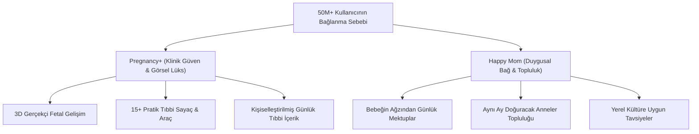

# Best Seller Hamilelik Uygulamaları — Kapsamlı Ekran ve Ürün Analizi

Bu analiz, `best seller örnek ekranlar` klasöründeki **34 ekran görüntüsünün** (Dünya lideri **Philips Pregnancy+** [50M+ indirme] ve Türkiye lideri **Happy Mom**) derinlemesine ürün, UX, kullanıcı psikolojisi ve içerik mimarisi incelemesidir.

---

## 1. Pazar Liderlerinin Başarı Formülü (Neden En Çok Satanlar?)

İncelenen iki uygulamanın pazar hakimiyeti tesadüf değildir. İki dev farklı güçleri mükemmel birleştirmiştir:

---

## 2. 34 Ekranın 5 Temel Çekirdek Modüle Ayrımı

### Modül 1: "Bugün" (Home & Günlük Yaşam Akışı)
*Görseller: 24, 25, 26, 27, 28, 29, 30, 31, 32, 33*

1. **Kahraman Başlık (Hero Header):**
   - Anneye özel selamlama: *"Günaydın Zeynep"*
   - Doğuma kalan gün sayısı + Tam haftası (Örn: *16. Hafta + 3 Gün*)
   - Trimester rozeti ve Tahmini Doğum Tarihi (EDD).
2. **Bebeğin Günlük Mesajı (Happy Mom'ın en güçlü silahı):**
   - Bebeğin dilinden yazılmış sıcak mikro-mektup: *"Anneciğim bugün minik parmaklarım tamamen ayrıştı, sesini duyunca kalbim hızlanıyor!"* (Kullanıcı retention ve her gün uygulamayı açma sebebi).
3. **Bugünün Önemli Okumaları (Daily Reading):**
   - O güne ve haftaya özel 2-3 adet hap makale kartı (Beslenme, belirtiler, babaya tavsiye).
4. **Hızlı Takip Widget'ları:**
   - Günlük su sayacı, vitamin hatırlatıcısı, anlık kilo girişi ve ruh hali.
5. **Geçmiş / Gelecek Zaman Tüneli (Timeline):**
   - Dünün özeti, yarın seni ne bekliyor, bu haftanın kritik taramaları.

---

### Modül 2: "Bebek Gelişimi & Boyut Rehberi"
*Görseller: 07, 08, 09, 14, 15, 34*

1. **3D İnteraktif Bebek Görüntüleyici (Pregnancy+'ın kalbi):**
   - Tam ekran 360° dönebilen fetus.
   - Gerçek boyut skalası, boy (cm) ve ağırlık (g) bilgisi.
   - İleri/geri hafta geçişiyle bebeğin nasıl büyüdüğünü canlı izleme.
2. **3'lü Boyut Karşılaştırma Rehberi (Size Guide):**
   - Sadece meyve değil; Pregnancy+ annelere 3 seçenek sunuyor:
     - 🍏 **Meyve & Sebze** (Limon, avokado...)
     - 🧸 **Sevimli Hayvanlar** (Uğur böceği, hamster, tavşan...)
     - 🧁 **Tatlılar / Nesneler** (Makaron, fincan...)
3. **Haftalık Ultrason Taramaları (2D & 3D Scans):**
   - Anne adaylarının en çok merak ettiği: *"Benim haftamdaki gerçek ultrason görüntüsü nasıl olmalı?"*
   - Normal 2D siyah-beyaz ultrason ve 3D renkli ultrason örnekleri.

---

### Modül 3: "Araçlar Kataloğu" (Tools & Utilities)
*Görseller: 16, 17, 18, 19, 20*

Hamile kadının 9 ay boyunca telefonuna başka hiçbir uygulama indirmesine gerek bırakmayan hepsi-bir-arada araç seti:

| Araç Adı | İşlevi ve Önemi |
|---|---|
| **Tekme Sayacı (Kick Counter)** | 28. haftadan sonra bebeğin hareketlerini sayma, acil durum uyarıları. |
| **Kasılma Sayacı (Contraction Timer)** | Doğum başladığında sancı sıklığı ve süresini ölçen, hastaneye gitme zamanını haber veren sayaç. |
| **Hastane Çantası (Hospital Bag)** | Anne, Bebek ve Refakatçi için 3 sekmeli, hazır tikli kontrol listesi. |
| **Bebek İsim Rehberi (Name Finder)** | Binlerce isim, anlamları, kökenleri ve favorilere ekleme (Tinder tarzı sağa/sola kaydırma). |
| **Kilo Takibi (Weight Tracker)** | Başlangıç kilosu, boy, BMI aralığına göre ideal kilo alma grafiği. |
| **Göbek Fotoğraf Günlüğü (Belly Bump)** | Haftalık karın fotoğraflarını yan yana koyup hızlandırılmış video/kolaj yapma. |
| **Doktora Sorulacak Sorular** | Rutin muayeneden önce unutulmaması gereken hazır tıbbi soru listesi. |
| **Doğum Planı (Birth Plan)** | Epidural, sezaryen/normal, ten tene temas gibi istekleri seçip PDF çıktı alma. |

---

### Modül 4: "Keşfet & Kütüphane" (Topic Collections)
*Görseller: 10, 11, 12, 13, 21, 22, 23*

- **Kategoriler:** Beslenme, Spor/Yoga, Doğum Çeşitleri, Emzirme, Uyku, Ruh Sağlığı, Tıbbi Belirtiler.
- **Eş / Baba Rehberi:** Eşlerin sürece nasıl dahil olacağını anlatan özel bölüm.
- **Çoğul Gebelik (İkiz/Üçüz):** İkiz bekleyen annelere özel tıbbi uyarılar.
- **Makale Sayfa Düzeni:** Büyük ferah kapak görseli, doktor onaylı içerik etiketi, tahmini okuma süresi ve sesli dinleme seçeneği.

---

### Modül 5: "Topluluk & Sosyal Alan" (Community)
*Görsel: 02 (Happy Mom)*

- **Aynı Ay Anneleri:** *"Mayıs 2026 Anneleri"*, *"İlk Trimesterda Olanlar"*.
- **Konu Başlıkları:** Bebek arabası tavsiyesi, doktor önerileri, aşerme, lohusalık korkusu.
- **Arama ve Yanıtlar:** Sorulan sorulara tecrübeli annelerden gelen yorumlar.

---

## 3. Momora vs Best Seller Karşılaştırma Matrisi (Fark Analizi)

| Özellik / Alan | Pregnancy+ & Happy Mom | Mevcut Momora | Momora İçin Fırsat & Hamle |
|---|---|---|---|
| **Tasarım Dili** | Standart kurumsal medikal / beyaz | **Çok daha sıcak, pastel, claymorphic, lüks** | **MOMORA KAZANIYOR!** Tasarım dilimizi bozmadan içeriği derinleştirmeliyiz. |
| **Giriş / Bugün** | Günlük mektup + timeline + haftalık özet | Hafta şeridi + özet kartı | Bebeğin ağzından günlük mesaj kartı ve timeline eklenmeli. |
| **Gelişim Görseli** | 3D İnteraktif Fetus + 3'lü Boyut Kıyaslaması | SVG Meyve İkonu | 3D/Webview Fetus + 3D Meyve/Nesne eşleşmesi. |
| **Araç Seti** | 15+ hayati araç (Tekme, Kasılma, Çanta...) | Temel randevu, su, vitamin | 4 kritik araç öncelikli: Kilo, Tekme, Kasılma, Hastane Çantası. |
| **İçerik Derinliği** | Yüzlerce kategorize makale ve koleksiyon | 1 adet örnek blog yazısı | Keşfet sekmesinde konu koleksiyonları ve makale detayları. |
| **Topluluk** | Canlı forum / anne grupları | Asistan içinde örnek pencere | Supabase tabanlı hafif bir soru-cevap/paylaşım modülü. |

---

## 4. Momora İçin 3 Aşamalı Yol Haritası (Master Plan)

### 1. Aşama: "Bugün & Hafta Detayı" Zenginleştirmesi (İlk Öncelik)
- [ ] Ana ekrana **"Bebeğinden Günlük Mektup"** kartı ekle (Happy Mom etkisi).
- [ ] Hafta detayına meyvenin yanına **boy / ağırlık ve gelişim aşamaları** kartlarını ekle.
- [ ] Mevcut `assets/blog_*.png` ve `assets/card_*.png` kütüphanemizi içerik kartlarına bağla.

### 2. Aşama: En Kritik 4 Hamilelik Aracının Entegrasyonu
- [ ] **Hastane Çantası:** Anne, Bebek ve Baba için hazır tiklenebilir liste.
- [ ] **Tekme Sayacı (Kick Counter):** 10 tekmeyi kaydetme ve süre tutma.
- [ ] **Kilo Takibi:** Başlangıç kilosu ve haftalık kilo eğrisi.
- [ ] **Kasılma Sayacı (Contraction Timer):** Doğum anı için hazır kronometre.

### 3. Aşama: Keşfet Koleksiyonları & Makale Detayı
- [ ] Beslenme, Egzersiz, Eş Rehberi gibi kategoriler.
- [ ] Tıklanınca açılan zengin görselli, ferah makale detay sayfası.
- [ ] İçerik içi arama.
